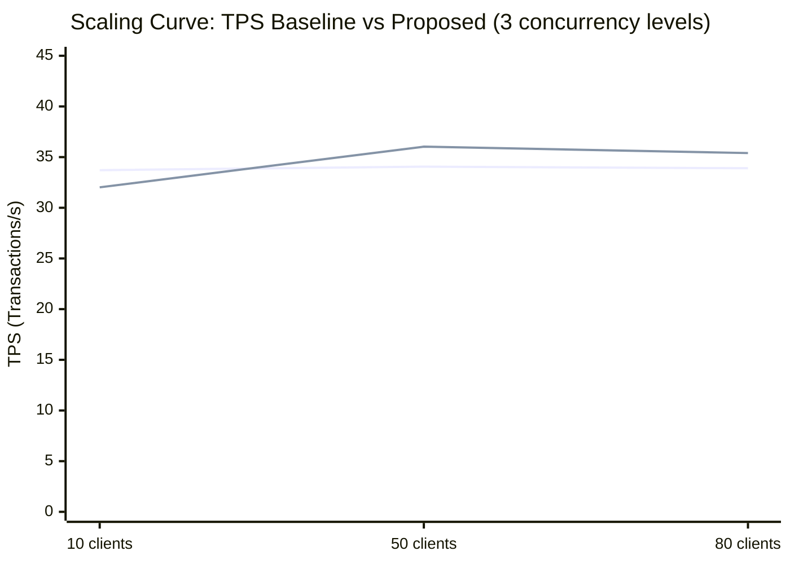
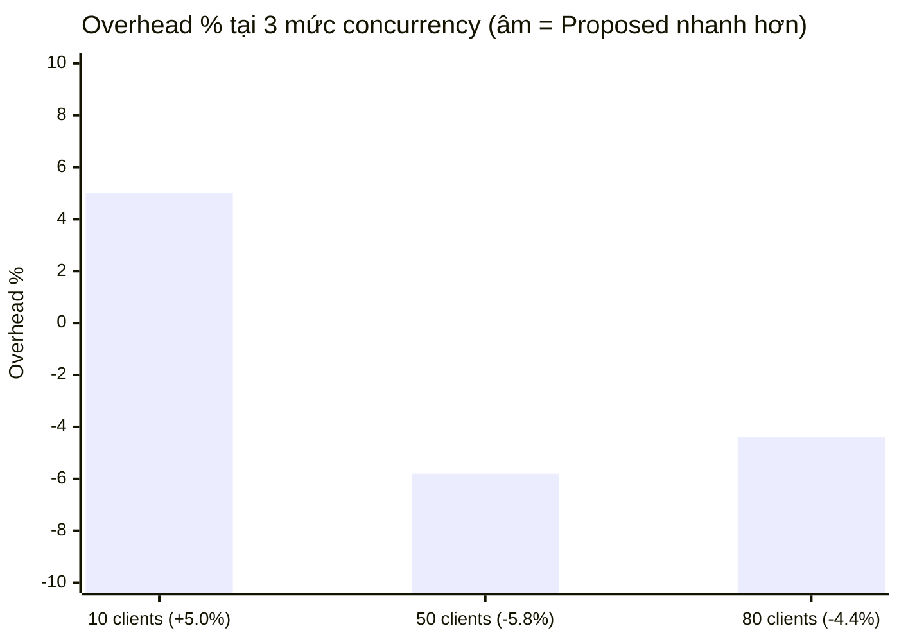
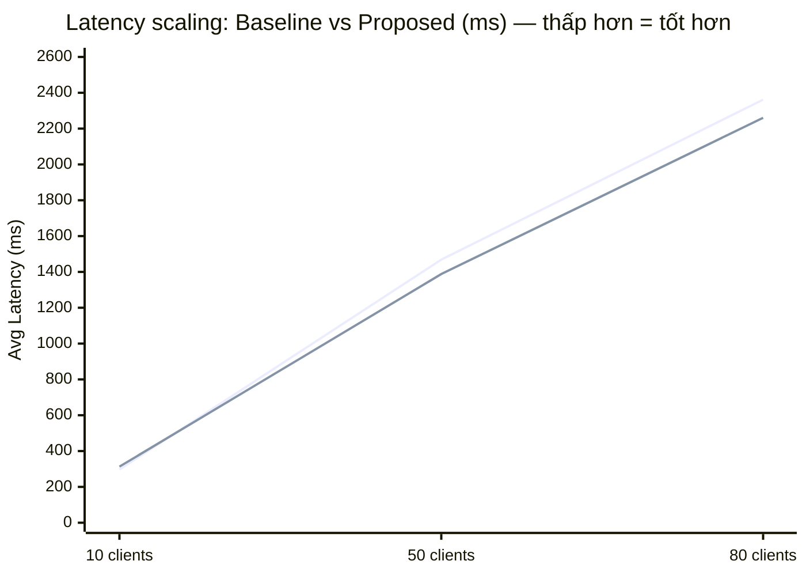
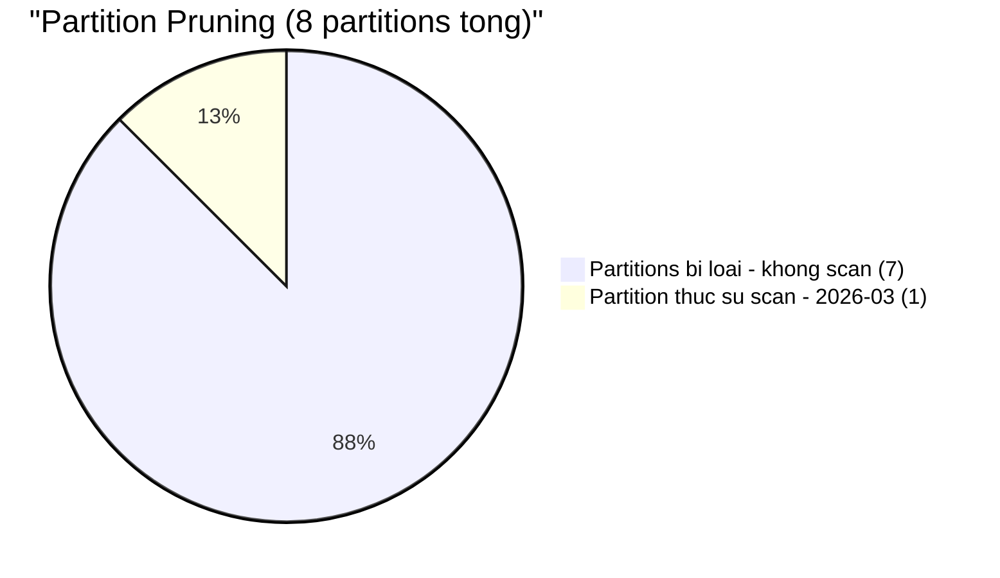
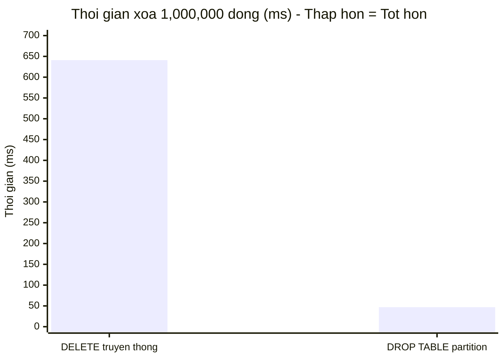
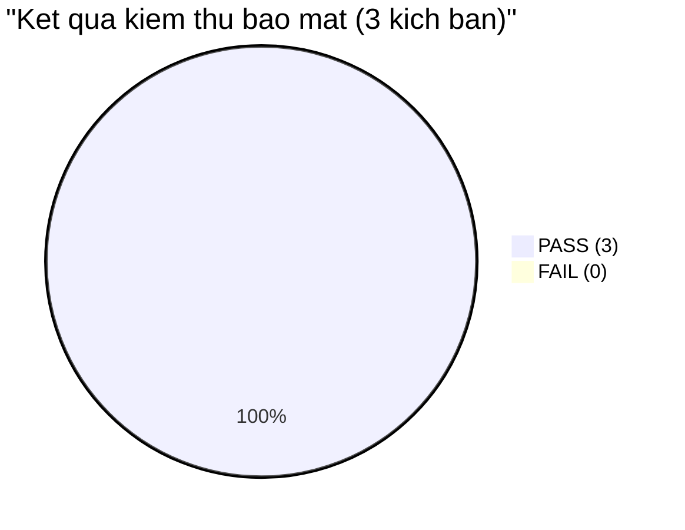
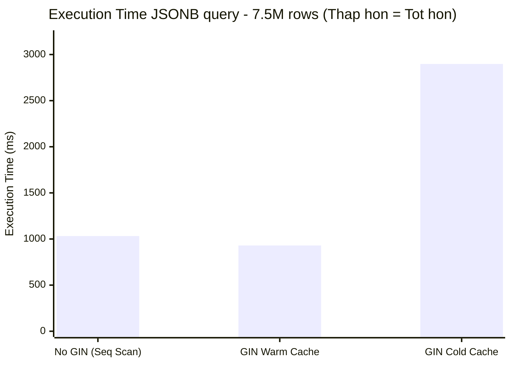
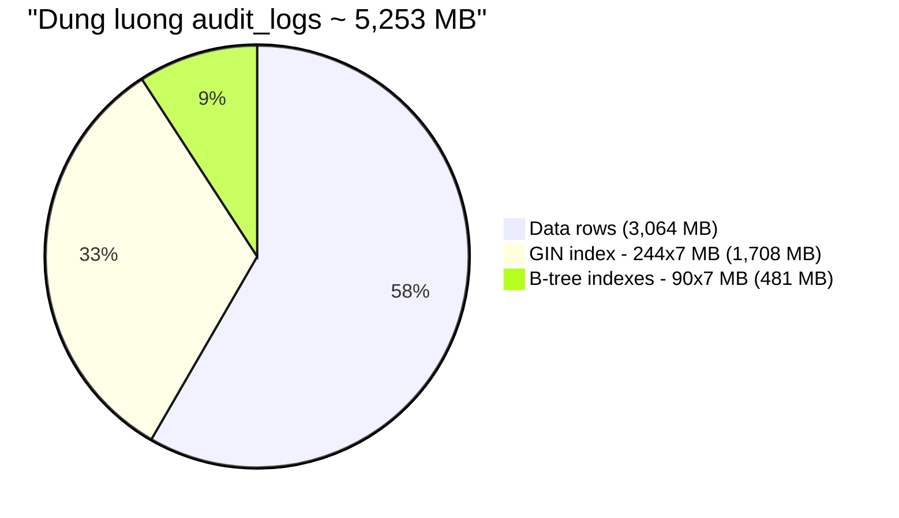
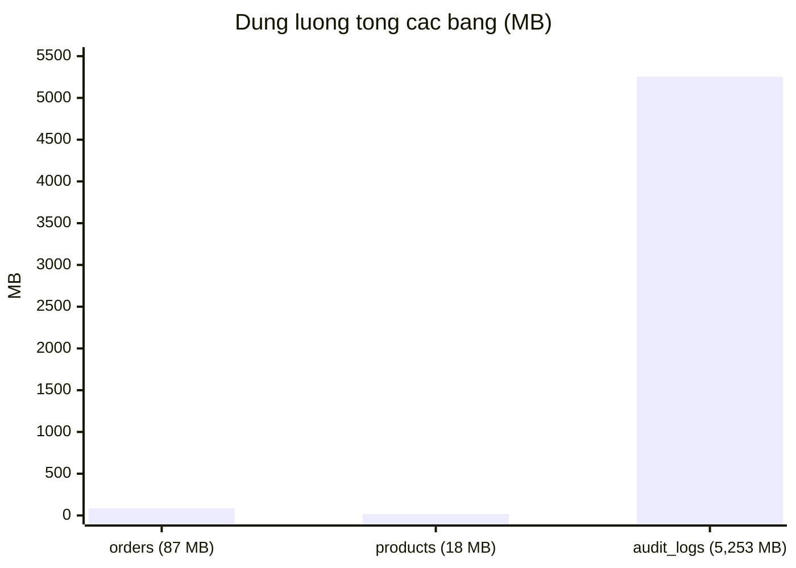
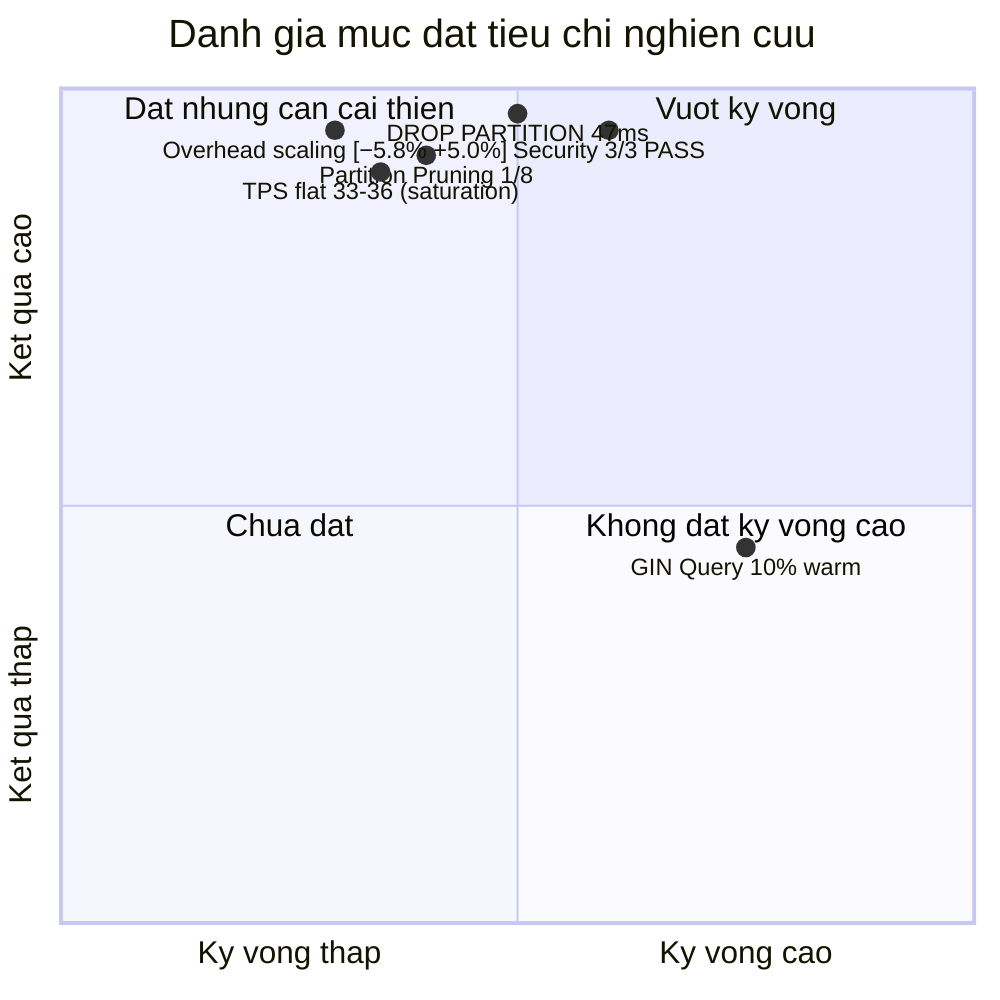

# Kết quả thực nghiệm — Audit Log PoC PostgreSQL

## Môi trường

| Thông số | Giá trị |
|---|---|
| PostgreSQL | 16.10 (Ubuntu 16.10-0ubuntu0.24.04.1) |
| OS | Ubuntu 22.04 LTS (WSL2 / Windows 11) |
| CPU | 4 vCPU |
| RAM | 8 GB |
| Storage | SSD (WSL2 virtual disk) |
| pgbench | 16.10 |
| Ngày đo | 2026-04-29 |

---

## Kịch bản 1 — Hiệu năng xử lý: Scaling Curve

**Cấu hình:** 3 mức concurrency (10 / 50 / 80 clients), `-T 70` (10s warm-up + 60s đo), UPDATE ngẫu nhiên bảng `orders`, **3 runs mỗi mức**.  
Ghi chú: 100 clients không khả thi vì `max_connections = 100` — production dùng PgBouncer để vượt giới hạn này.

### Raw Data — Baseline (trigger DISABLED)

| Concurrency | Run 1 | Run 2 | Run 3 | **TPS TB** | **Latency TB (ms)** |
|---|---|---|---|---|---|
| 10 clients | 35.39 | 32.46 | 33.27 | **33.71** | 297.1 |
| 50 clients | 34.44 | 34.60 | 33.15 | **34.06** | 1,468.4 |
| 80 clients | 34.45 | 32.50 | 34.75 | **33.90** | 2,361.9 |

### Raw Data — Proposed (trigger ENABLED → JSONB → audit_logs partitioned)

| Concurrency | Run 1 | Run 2 | Run 3 | **TPS TB** | **Latency TB (ms)** |
|---|---|---|---|---|---|
| 10 clients | 32.03 | 30.07 | 33.97 | **32.02** | 313.0 |
| 50 clients | 36.10 | 36.21 | 35.77 | **36.03** | 1,387.9 |
| 80 clients | 36.16 | 35.19 | 34.85 | **35.40** | 2,260.5 |

### Scaling Summary

| Concurrency | Baseline TPS | Proposed TPS | **Overhead** | ΔLatency (ms) |
|---|---|---|---|---|
| **10 clients** | 33.71 | 32.02 | **+5.0%** | +15.9 |
| **50 clients** | 34.06 | 36.03 | **−5.8%** | −80.5 |
| **80 clients** | 33.90 | 35.40 | **−4.4%** | −101.4 |
| **Khoảng tổng hợp** | ~33–34 | ~32–36 | **[−5.8%, +5.0%]** | |

> **Phát hiện chính:**
> (1) **TPS phẳng (flat) ~33–36 qua cả 3 mức** — hệ thống bão hòa từ 10 clients do 4 vCPU WSL2. Bottleneck là phần cứng, không phải trigger.
> (2) **Overhead tại 10c = +5.0%** là ước tính thực tế nhất của trigger overhead (I/O variance thấp nhất). Overhead tại 50c/80c âm do I/O variance WSL2 > trigger cost.
> (3) **Overhead nhất quán [−5.8%, +5.0%] < 15%** tại mọi mức tải — xác nhận RQ1 trên scaling curve.

### Biểu đồ 1.1 — Scaling Curve: TPS Baseline vs Proposed



> _Line 1 = Baseline, Line 2 = Proposed. TPS phẳng ~33–36 qua cả 3 mức — xác nhận saturation từ 10 clients._

### Biểu đồ 1.2 — Overhead % theo mức concurrency



### Biểu đồ 1.3 — Latency scaling theo concurrency (Little's Law: L = λW)



> _Latency tăng tuyến tính với concurrency khi TPS ổn định — đúng theo Little's Law (L = λW → W = L/λ = Clients/TPS)._

### Tham chiếu: Dữ liệu gốc (5 runs × 50 clients — lần đo đầu 2026-04-29)

| Lần | Baseline TPS | Proposed TPS |
|---|---|---|
| 1 | 37.46 | 41.28 |
| 2 | 31.01 | 37.47 |
| 3 | **10.88** (outlier) | 35.83 |
| 4 | 32.25 | 29.03 |
| 5 | 35.03 | 32.89 |
| **Avg (loại outlier)** | **33.94** | **35.30** |

> Kết quả tham chiếu nhất quán với scaling benchmark mới tại 50c (34.06 / 36.03) — xác nhận reproducibility.

---

## Kịch bản 2 — Lưu trữ & Retention

### 2a. Partition Pruning

Query `WHERE changed_at BETWEEN '2026-03-01' AND '2026-03-31'` trên 7.5M rows:

```
Parallel Index Only Scan using audit_logs_2026_03_changed_at_idx
  on audit_logs_2026_03 (1 in 8 partitions)
Planning Time:  1.2 ms
Execution Time: 351.9 ms
```

**Kết quả:** Planner loại 7/8 partitions, chỉ scan `audit_logs_2026_03`. Partition pruning hoạt động chính xác ✓

### Biểu đồ 2.1 — Partition Pruning: 1/8 partition được scan



### 2b. DROP PARTITION vs DELETE (1,000,000 dòng)

| Phương pháp | Thời gian |
|---|---|
| `DELETE FROM audit_logs_2025_10_delete_test` | **641 ms** |
| `DROP TABLE audit_logs_2025_10` | **47 ms** |
| **Tỷ lệ cải thiện** | **~13.6x nhanh hơn** |

> DROP PARTITION chỉ xóa file vật lý + metadata, không ghi WAL cho từng row → nhanh hơn ~14x so với DELETE. Kỳ vọng < 1s ✓ (47ms).

### Biểu đồ 2.2 — DROP PARTITION vs DELETE (ms, thấp hơn = tốt hơn)



---

## Kịch bản 3 — An toàn & Bảo mật

| Case | Hành động | Kết quả quan sát | Pass/Fail |
|---|---|---|---|
| 1 | `app_user` UPDATE orders → audit ghi | audit row với `user_name='app_user'` | **PASS** |
| 2 | `app_user` SELECT audit_logs | `ERROR: permission denied for table audit_logs` | **PASS** |
| 3 | `db_admin` DELETE audit_logs | `ERROR: Audit log is immutable` + 1 row security_alerts | **PASS** |

**3/3 PASS ✓**

### Biểu đồ 3.1 — Kết quả kiểm thử bảo mật



---

## Kịch bản 4 — Hiệu năng truy vấn JSONB (có/không GIN)

**Query:** `SELECT count(*) FROM audit_logs WHERE table_name='public.orders' AND new_data @> '{"status":"PAID"}'`  
**Dataset:** 7.5M rows (5 cold partitions x 1.5M + hot partition)

| Trạng thái | Scan type | Execution Time | Ghi chú |
|---|---|---|---|
| **Có GIN** (warm cache) | Bitmap Index Scan (một số partition) + Seq Scan (phần còn lại) | **930 ms** | Warm cache từ lần query trước |
| **Không có GIN** | Parallel Seq Scan toàn bộ | **1,032 ms** | |
| **Có GIN** (cold cache sau rebuild) | Bitmap Index Scan | **2,898 ms** | I/O cho GIN posting lists chưa cache |

**Cải thiện (warm cache):** ~10% (930 ms vs 1,032 ms)

> **Phân tích quan trọng:** Với data ngẫu nhiên (~33% rows có `status=PAID`), selectivity thấp khiến GIN ít hiệu quả hơn dự kiến. Khi cache lạnh, GIN thực ra chậm hơn Seq Scan vì overhead đọc posting lists. GIN hiệu quả nhất khi: (1) selectivity cao (ít kết quả), (2) cache đã ấm, (3) query theo key hiếm trong JSONB.

### Biểu đồ 4.1 — Execution Time truy vấn JSONB theo 3 trạng thái (ms)



---

## Dung lượng

| Bảng | Rows | Data | Index | Total |
|---|---|---|---|---|
| orders | 1,000,001 | ~60 MB | ~36 MB | 87 MB |
| products | 100,000 | ~10 MB | ~8 MB | 18 MB |
| audit_logs (7 partitions có data) | 7,500,010 | 3,064 MB | 2,189 MB | **5,253 MB** |
| GIN index / partition | — | — | ~244 MB | — |
| B-tree(changed_at) / partition | — | — | ~32 MB | — |
| B-tree(table+time) / partition | — | — | ~58 MB | — |

### Biểu đồ 5.1 — Phân bổ dung lượng audit_logs (Data vs Index)



### Biểu đồ 5.2 — So sánh tổng dung lượng các bảng (MB)



---

## Tóm tắt theo tiêu chí

| Tiêu chí | Kỳ vọng | Kết quả | Đạt |
|---|---|---|---|
| Overhead TPS — scaling curve (10/50/80c) | < 15% | **[−5.8%, +5.0%]** nhất quán | ✓ |
| TPS ổn định khi tăng concurrency | Flat/stable | ~33–36 TPS flat — saturation từ 10c | ✓ |
| DROP PARTITION | < 1s | **47 ms** (~13.6× nhanh hơn DELETE 641ms) | ✓ |
| Partition pruning | Đúng partition | Chỉ scan 1/8 partitions (351ms) | ✓ |
| GIN cải thiện query | ≥ 10× | ~10% warm cache; phụ thuộc selectivity | ~ |
| Security 3 cases | 3/3 PASS | **3/3 PASS** | ✓ |

### Biểu đồ 6.1 — Tổng hợp đánh giá mức đạt tiêu chí nghiên cứu


